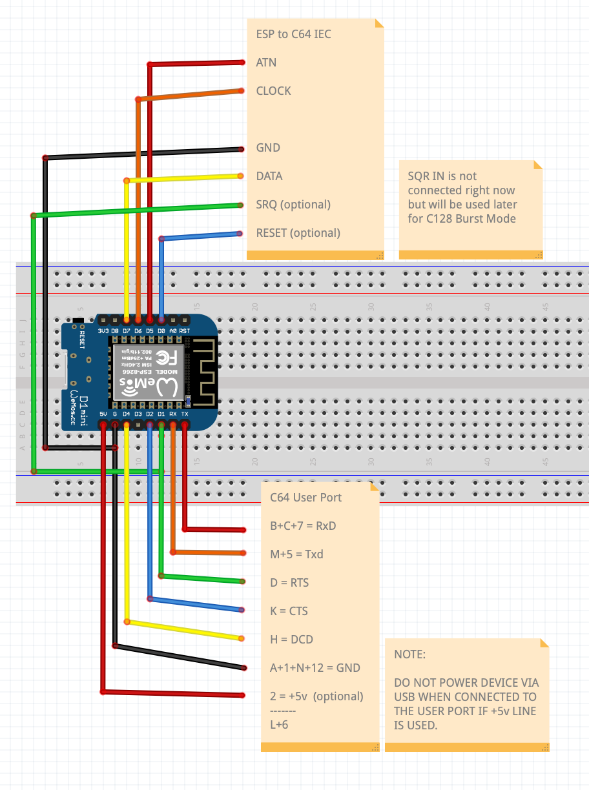

# Meatloaf

Commodore 64/128 WiFi Modem and IEC Serial Floppy Drive multi-device emulator

[Here is a video showing it in action.](https://youtu.be/q6IYi3TIGNI)

It's easy to wire up too.  (No need for the level shifter) 
You can also leave off the edge card connector if you you just want to try out the drive emulation functionality.

Code is based on and inspired by the following:

* Steve White's Pi1541 (https://github.com/pi1541/Pi1541)
* Lars Wadefalk's UNO2IEC (https://github.com/Larswad/uno2iec) & SD2IEC (https://github.com/Larswad/sd2iec_mega2560)
* Paul Rickard's ESP8266 Modem (https://github.com/RolandJuno/esp8266_modem)
* Ardyesp's ESPWebDAV (https://github.com/ardyesp/ESPWebDAV)

To setup your own Meatloaf server check out this code.
(https://github.com/idolpx/meatloaf-svr)

I'm now working to bring this functionality to the [#FujiNet](https://github.com/FujiNetWIFI/fujinet-platformio) project too!
They had the same idea but for Atari 8bit machines and are much further along than I am.
I'm working with them to add CBM support to their device.

Key Features
------------

* WiFi modem for connecting to telnet BBSs
* Can mount device's flash file system via WebDAV to edit contents
* IEC Bus interface for loading data directly from flash memory or via HTTP
* Can be configured to simulate multiple IEC devices (IDs 4-30)
* Each device's configuration is switched out and persisted on access (hidden folder ".sys")
* Firmware can be updated via HTTP

To Do
-----

* Standardize all Hayes Commands and add extended commands
* Complete CBM DOS support
* Extend CBM DOS with device specific features
* Support all different CBM file, disk, tape, cart media image files from local flash file system
* Add support for Fast Loaders & JiffyDOS
* Port all code to ESP32 IDF
* Add SD card interface
* Add Cassette tape interface
* Add virtual printer/plotter interface
* Add ZoomFloppy/IECHost capabilities
* Add .URL/.WEBLOC file support (change URL/DIR when loading them)
* If image isn't local, write saves to hidden folder ".save" (include hash of URL/PATH/IMAGE in filename)
* Add web server for configuration and control (http root hidden folder ".www")

References
----------

* https://www.pagetable.com/?p=1018
* http://www.zimmers.net/anonftp/pub/cbm/programming/serial-bus.pdf
